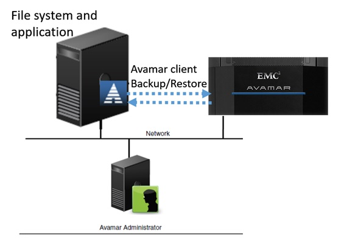
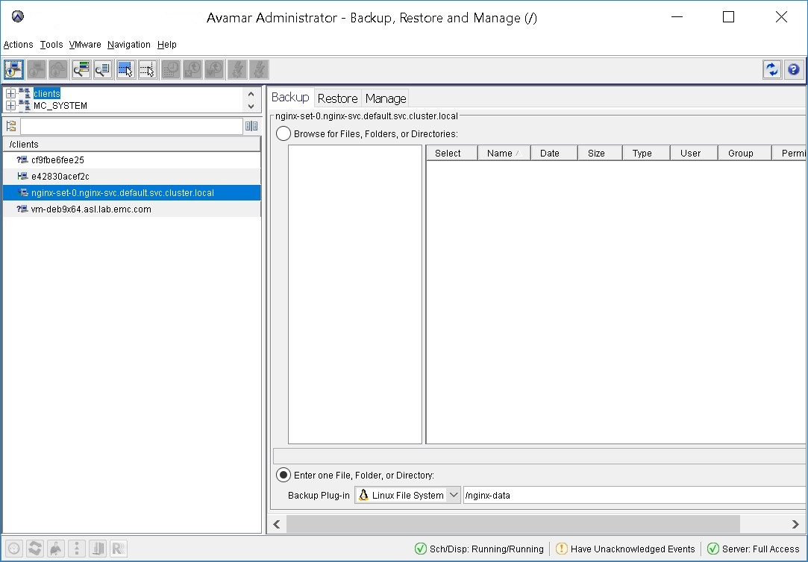
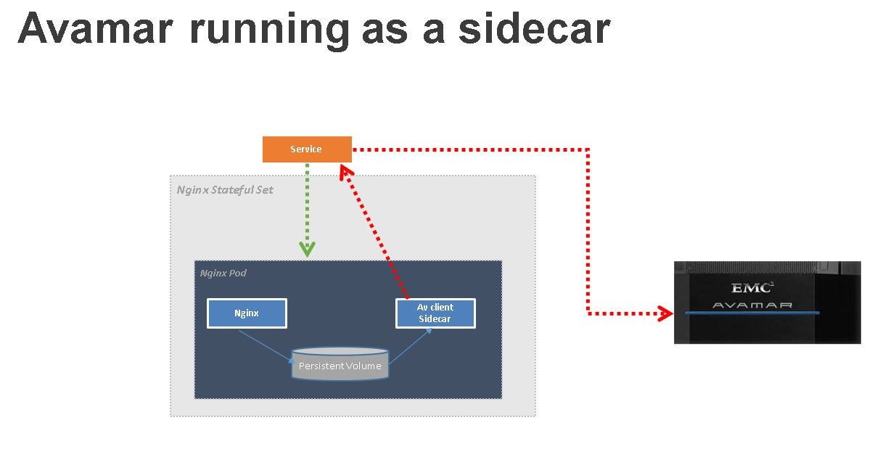
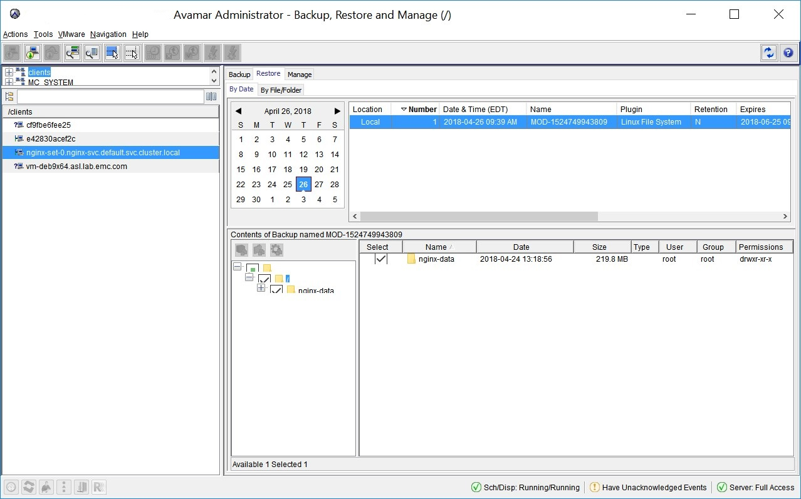
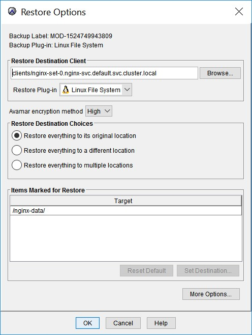

# Leveraging Avamar for File Level Backup of apps running on Kubernetes


**Executive summary:**

Kubernetes was released in the summer of 2014 and since then has been growing dramatically to emerge as the defacto platform for container orchestration and management. Oftentimes data-protection is an afterthought, hence despite the huge growth in adoption, data protection for applications running on Kubernetes still lags behind. Therefore there is a need to develop solution that will enable Kubernetes administrators and developers to easily set up and configure data protection plans and policies for these containerized applications.

DELLEMC Avamar is a world-leading data protection product designed to protect various client types. It is based on client-server architect. Avamar client is a lightweight software and available for cross platforms, including Linux, Windows, Mac, etc. it is like a system service. In traditional P2 environment Avamar client runs on physical hosts or VM and communicate with the Avamar server, Avamar administrator initiate backups and restores via Avamar UI.


Moving the applications to a Kubernetes platform presents a challenge to the Avamar administrator which this paper will address a way to overcome this challenge. The Avamar administrator needs to establish a method for deploying the Avamar client in Kubernetes and a way to establish communication between the Avamar client and the Avamar server.

**Why Avamar:**

Avamar is a backup and recovery storage product. It uses deduplication to reduce
the amount of disk space required to store those backups. Because Avamar
performs client-side de-duplication (shrinking data at the source), it sends
only the minimum data necessary across the network to the Avamar system.
Therefore, it is ideal for users who require frequent, fast, full backups. Users
can combine Avamar with Data Domain solutions for even greater backup
performance and advanced capabilities.

Combined with Data Domain, Avamar offers:

-   De-duplicated backups.

-   Compressed backups.

-   Reduction in backup transfer time.

-   Reduction in bandwidth requirement.

-   Encrypted backups.

-   Incremental-Forever backups

**How to leverage Avamar:**

Kubernetes provides a PersistentVolume (PV) API which allows an application to consume storage. This storage could be NFS, iSCSI, or cloud-provider-specific storage. It is common that users need to back up the PersistentVolume data, however there is a gap for doing so. Avamar provides a solution to overcome this gap by providing an efficient way for backing up PersistentVolume data.

Building an application from modular containers means thinking about symbiotic
groups of containers that cooperate to provide a service, not one container per
service.  In Kubernetes, the embodiment of this modular container service is a
Pod.  A Pod is a group of containers that share resources like file systems,
kernel namespaces and an IP address.  The Pod is the atomic unit of scheduling
in a Kubernetes cluster, precisely because the symbiotic nature of the
containers in the Pod require that they be co-scheduled onto the same machine,
and the only way to reliably achieve this is by making container groups atomic
scheduling units.  Thinking in terms of Pods, there are naturally some general
patterns of modular application development that re-occur multiple times.

One commonly used is Sidecar containers that extend and enhance the “main”
container, they take existing containers and make them better.

As an example, the steps below walks through deploying Nginx web server
StatefulSet and add Avamar agent as a sidecar to perform backup of the Nginx web
server:

1.  Build Avamar agent docker image.  
    To build the Docker image the following are needed:  
    - The Avamar agent binary file
    (AvamarClient-linux-sles11-x86_64-7.5.101-101.rpm).  
    - run.sh script, this script runs when the Avamar container starts up.
        ```shell
        #!/bin/bash
        rpm -ivh /tmp/AvamarClient-linux-sles11-x86_64-7.5.101-101.rpm
        # $Node_IP is the IP address of the node where the pod is running
        # This will be passed down to the pod as environment variable.
        echo "--iplist=$NODE_IP" > /usr/local/avamar/var/avagent.cmd
        # $AVAMAR_SERVER is the Avamar server IP address, this will be passed down
        # to the pod as environment variable.
        /etc/init.d/avagent register "$AVAMAR_SERVER" "/clients"
        /usr/sbin/sshd -D 
        ```   
    - docker file: dockerfile-example
        ```dockerfile
        FROM centos:7
        RUN yum install -y openssh-server \
        && yum install -y inetutils-ping iproute net-tools initscripts\
        && yum clean all \
        && ssh-keygen -t dsa -f /etc/ssh/ssh_host_dsa_key \
        && ssh-keygen -t rsa -f /etc/ssh/ssh_host_rsa_key 
        #Add Avamar Agent. 
        ADD AvamarClient-linux-sles11-x86_64-7.5.101-101.rpm /tmp/AvamarClient-linux-sles11-x86_64-7.5.101-101.rpm
        #prepare run.sh for avamar register & avagent.
        ADD run.sh /usr/local/sbin/run.sh
        RUN chmod 755 /usr/local/sbin/run.sh
        CMD ["/usr/local/sbin/run.sh"]
        ```

    After building the Docker image upload the image to your Docker registry.

2.  Expose the StatefulSet via a service:  
    To have an application accessible from outside Kubernetes the application
    needs to be exposed via a service. A service in Kubernetes is an abstraction
    which defines a logical set of pods and a policy by which to access them.

    The below (nginx-service.yaml) file exposes the Nginx StatefulSet (Nginx app and the Avamar
    agent) by defining NodePorts that are required to establish communication
    between the Avamar agent and the Avamar server, as well as the Nginx app.
    ```yaml
    apiVersion: v1
    kind: Service
    metadata:
    name: nginx-svc
    spec:
    type: NodePort
    ports: # These Ports need to be exposed for Avamar agent to communicate with the Avamar server
    - port: 22
        nodePort: 32050
        name: agentport
    - port: 7778
        nodePort: 32051
        name: agentport1
    - port: 7779
        nodePort: 32052
        name: agentport2
    - port: 7780
        nodePort: 32053
        name: agentport3
    - port: 7781
        nodePort: 32054
        name: agentport4
    - port: 9090
        nodePort: 32055
        name: agentport5
    - port: 9091
        nodePort: 32056
        name: agentport6
    - port : 9092
        nodePort: 32057
        name: agentport7
    - port: 9093
        nodePort: 32058
        name: agentport8
    - port: 2700
        nodePort: 32059
        name: agentport9
    - port: 27001
        nodePort: 32060
        name: agentport10
    - port: 27002
        nodePort: 32061
        name: agentport11
    - port: 27003
        nodePort: 32062
        name: agentport12
    - port: 27004
        nodePort: 32063
        name: agentport13
    - port: 28000
        nodePort: 32064
        name: agentport14
    - port: 28001
        nodePort: 32065
        name: agentport15
    - port: 28002
        nodePort: 32066
        name: agentport16
    - port: 28003
        nodePort: 32067
        name: agentport17
    - port: 28004
        nodePort: 32068
        name: agentport18
    - port: 29000
        nodePort: 32069
        name: agentport19
    - port: 30000
        nodePort: 32070
        name: agentport20
    - port: 30001
        nodePort: 32071
        name: agentport21
    - port: 30002
        nodePort: 32072
        name: agentport22
    - port: 30003
        nodePort: 32073
        name: agentport23
    - port: 30004
        nodePort: 32074
        name: agentport24
    - port: 30102
        nodePort: 32075
        name: agentport25
    - port: 30103
        nodePort: 32076
        name: agentport26
    - port: 30104
        nodePort: 32077
        name: agentport27
    - port: 30105
        nodePort: 32078
        name: agentport28
    - port: 53
        nodePort: 32079
        name: agentport29
    - port: 123
        nodePort: 32080
        name: agentport30
    - port: 443
        nodePort: 32081
        name: agentport31
    - port: 3008
        nodePort: 32082
        name: agentport32
    - port: 8105
        nodePort: 32083
        name: agentport33
    - port: 8109
        nodePort: 32084
        name: agentport34
    - port: 8141
        nodePort: 32085
        name: agentport35
    - port: 8181
        nodePort: 32086
        name: agentport36
    - port: 8444
        nodePort: 32087
        name: agentport37
    - port: 8080
        nodePort: 30808
        name: nginx
    selector:
        app: nginx
    ```
    ```console
    $ kubectl create -f nginx-service.yaml
    service "nginx-svc" created
    ```


3.  Deploy Nginx StatefulSet with Avamar agent running as a sidecar.
    ```yaml
    apiVersion: apps/v1
    kind: StatefulSet
    metadata:
    name: nginx-set
    spec:
    selector:
        matchLabels:
        app: nginx
    serviceName: nginx-svc
    replicas: 1
    template:
        metadata:
        labels:
            app: nginx
        spec:    
        containers:
        - image: avamaragent:1.0
            name: avamar
            ports: 
            - containerPort: 22
            - containerPort: 8080
            - containerPort: 28002
            - containerPort: 30001
            - containerPort: 30002
            - containerPort: 53
            - containerPort: 123
            - containerPort: 443
            - containerPort: 3008
            - containerPort: 8105
            - containerPort: 8109
            - containerPort: 8181
            - containerPort: 8444
            - containerPort: 27000
            - containerPort: 27001
            - containerPort: 29000
            - containerPort: 30101
            - containerPort: 30103
            env:
            - name: NODE_IP
            valueFrom:
                fieldRef:
                fieldPath: status.hostIP
            - name: AVAMAR_SERVER
            value: "1.1.1.1" # change this to Avamar server IP.
            volumeMounts:
            - name: data # this is used to persist avamar config data.
            mountPath: /usr/local/avamar
            subPath: avamarfiles
            - name: data # this is used to persist avamar config data.
            mountPath: /var/avamar
            subPath: avamarconf
            - name: data # this is nginx data that will be backed up.
            mountPath: /nginx-data
        - image: nginx
            name: nginx
            ports:
            - containerPort: 8080
            volumeMounts:
            - name: data
            mountPath: /usr/share/nginx/html
    volumeClaimTemplates:
    - metadata:
        name: data
        spec:
        accessModes: [ "ReadWriteOnce" ]
        resources:
            requests:
            storage: 10Gi
    ```
    ```console
    $ kubectl create -f nginx-statefulset.yaml
    statefulset.apps "nginx-set" created
    ``` 
Once the StatefulSet is created you can check the Avamar server to verify the
agent has registered.  
Currently there is a limitation on browsing for files and directory, to perform
a backup the user must specify the path to backup.



The below diagram shows the example we used to deploy Nginx StatefulSet with
avamar agent running as a side car.



**Scheduling backups**

Scheduled backups run automatically to ensure that backups occur on an ongoing
basis. You can schedule backups to run daily, weekly, or monthly. The scheduled
backup can include multiple clients or a single server. Please refer to Avamar
Guide on how to set up scheduled backups.

**Restoring data from backup**

A user can find a backup to restore either by date or by content of the backup.
When performing a restore, the user can restore to the original location, a
different location, or multiple location.



Once the backup is selected the user can chose the restore destination.



**Conclusion**

There are different ways of deploying Avamar agent, however in this case we
chose StatefulSet because by definition StatefulSet Pods have a unique identity
that is comprised of an ordinal, a stable network identity, and stable storage.
The identity sticks to the Pod, regardless of which node it’s (re)scheduled on.
This guarantees that once the Avamar agent is registered with the Avamar server
it will always maintain its identity regardless of pods scheduling which ensures
only 1 agent is registered for the given pod.

Kubernetes is transforming from being used in experiments to a production grade
infrastructure that powers production applications. We hope this paper sheds some
light on how to leverage Avamar as a backup solution for apps running on Kubernetes.

**Reference:**

<https://kubernetes.io/docs/concepts/overview/what-is-kubernetes/>

<https://www.emc.com/collateral/TechnicalDocument/docu85219.pdf>
